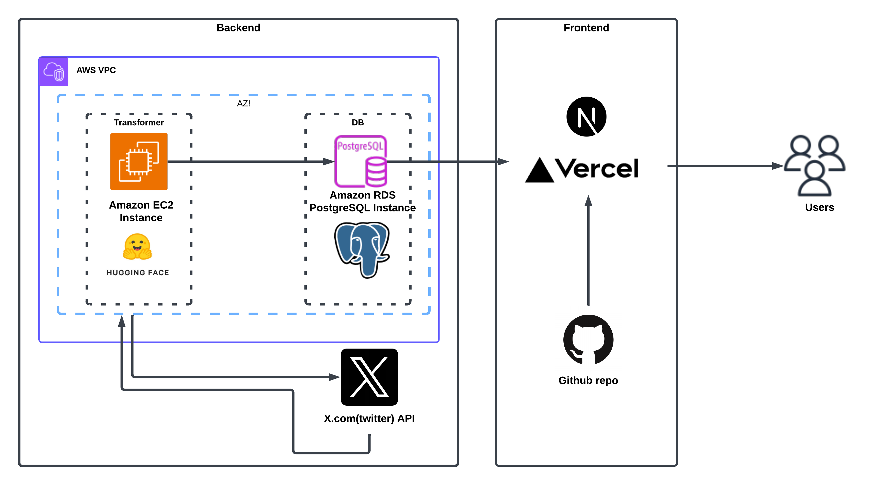

# H1B Twitter Analyzer

## Project Overview
H1B Twitter Analyzer is a two-part project designed to analyze sentiment from tweets related to "H1B" using advanced sentiment analysis techniques powered by Hugging Face transformers. The project includes:

1. *Frontend (React + Next.js)*: A dashboard to visualize tweet sentiment in real-time.
2. *Backend (Python)*: A Twitter scraper using Tweepy and PostgreSQL database to fetch and store tweets, along with a sentiment analysis pipeline.

This project is deployed using Vercel for the frontend and an AWS EC2 instance for the backend.

---
## Architecture



---

## Folder Structure

```
H1B_Twitter_Project
├── Frontend
│   ├── .env
│   ├── public/
│   ├── src/
│   │   ├── components/
│   │   ├── pages/
│   │   └── styles/
│   ├── next.config.mjs
│   ├── package.json
│   ├── tailwind.config.mjs
│   ├── README.md
│   └── ...
├── Python_Backend
│   ├── .env
│   ├── requirements.txt
│   ├── twitter_test.py
│   ├── README.md
│   └── ...

```
---

## Frontend

### Description
The frontend is built using *React* with the *Next.js* framework and styled using *Tailwind CSS*. It provides a dashboard to:
- Display tweets fetched from the database.
- Show sentiment analysis results using visualizations (e.g., charts).

### Key Features
- *Dashboard*: Displays sentiment analysis results (positive, neutral, negative).
- *Charts*: Uses libraries like chart.js or recharts for interactive graphs.
- *Responsive Design*: Ensures compatibility across all devices.

### Environment Variables
Add the following to Frontend/.env:
env
NEXT_PUBLIC_API_URL=<API Endpoint for Backend>


### Installation and Setup
1. Navigate to the frontend folder:
   bash
   cd Frontend
   
2. Install dependencies:
   bash
   npm install
   
3. Run the development server:
   bash
   npm run dev
   
4. Deploy using *Vercel*:
   - Connect to your GitHub repo.
   - Add environment variables in Vercel.

---

## Backend

### Description
The backend is written in *Python* and handles:
- Fetching tweets using the *Tweepy* library.
- Performing sentiment analysis using *Hugging Face transformers*.
- Storing and updating tweets in a *PostgreSQL* database.

### Key Features
1. *Tweet Scraper*: Fetches tweets with retry logic and handles rate limits.
2. *Sentiment Analysis*: Uses nlptown/bert-base-multilingual-uncased-sentiment from Hugging Face for advanced sentiment classification.
3. *Database Operations*:
   - Inserts new tweets into the database.
   - Updates existing tweets with refined sentiment analysis.

### Environment Variables
Add the following to Python_Backend/.env:
env
BEARER_TOKEN=<Twitter API Bearer Token>
DB_HOST=<PostgreSQL Host>
DB_NAME=<Database Name>
DB_USER=<Database Username>
DB_PASS=<Database Password>
DB_PORT=5432


### Installation and Setup
1. Navigate to the backend folder:
   bash
   cd Python_Backend
   
2. Create a virtual environment:
   bash
   python3 -m venv .venv
   source .venv/bin/activate
   
3. Install dependencies:
   bash
   pip install -r requirements.txt
   
4. Run the script:
   bash
   python twitter_test.py
   

---

## Database

### Description
The project uses *PostgreSQL* to store:
- Tweet metadata (ID, content, username, etc.).
- Sentiment analysis results.

### Schema
#### Table: tweets
| Column      | Type        | Description                     |
|-------------|-------------|---------------------------------|
| tweet_id  | VARCHAR     | Unique ID of the tweet          |
| username  | VARCHAR     | Username of the tweet author    |
| content   | TEXT        | Content of the tweet            |
| sentiment | VARCHAR     | Sentiment (positive/neutral/negative) |
| created_at| TIMESTAMP   | Tweet creation timestamp        |

### Duplicate Handling
To remove duplicates, use:
sql
DELETE FROM tweets
WHERE ctid NOT IN (
    SELECT MAX(ctid)
    FROM tweets
    GROUP BY content
);


---

## Deployment

### Frontend
1. Deploy using *Vercel*:
   - Connect your repository.
   - Add environment variables (NEXT_PUBLIC_API_URL).
2. Trigger a build.

### Backend
1. Set up an *AWS EC2* instance:
   - Install dependencies (Python3, PostgreSQL).
2. Clone the backend repository:
   bash
   git clone <repo-url>
   
3. Set up environment variables in .env.
4. Run the script as a service or use a task scheduler (e.g., cron).

---

## Technologies Used

### Frontend
- *React* with *Next.js*
- *Tailwind CSS*
- *Chart.js* or *Recharts*

### Backend
- *Python*
  - Tweepy (Twitter API)
  - Transformers (Hugging Face)
  - psycopg2 (PostgreSQL connection)
  - dotenv (Environment variable management)
- *PostgreSQL* (Database)

### Deployment
- *Vercel* (Frontend hosting)
- *AWS EC2* (Backend hosting)

---

## Contributing
Feel free to submit pull requests or report issues.

---

## License
This project is licensed under the MIT License. See the LICENSE file for details.

---

## Acknowledgments
This project was developed collaboratively by [Venkata Mohith Mrunal Attuluri](https://github.com/mohithmrunal) and [Varun Mohankumar Jayasree(Myself)](https://github.com/varunmj). 
